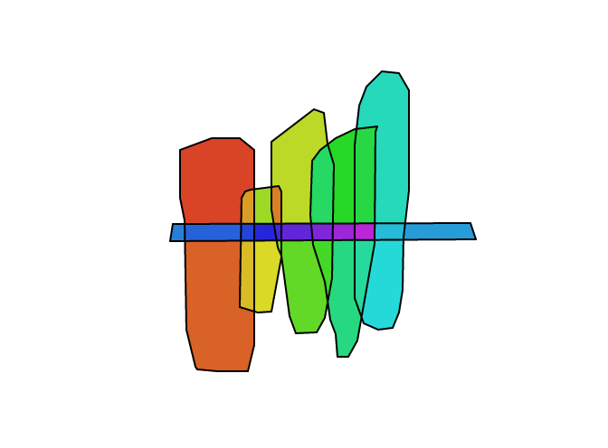

# cycles



this script wil ( try to ) collect all the cycles of an undirected graph. the graph needs to have cycles, so it won't work properly on Directed Acyclic Graphs (_trees_). it makes intensive use of [clean-pslg](https://github.com/mikolalysenko/clean-pslg) by [Mikola Lysenko](https://github.com/mikolalysenko).

it works reasonably well on trivial cases but is very much in a "_for learning purpose_" state (don't use it in production).
to run the demo:

```
npm i
npm run dev
```

then go to `http://localhost:1234/` and start rawing something.

the _Cycles.js_ code is commented and [this blog post](https://blog.mrpetovan.com/web-development/algorithm-101-finding-all-polygons-in-an-undirected-graph/) explains very well how the algo works(and its limitations).
